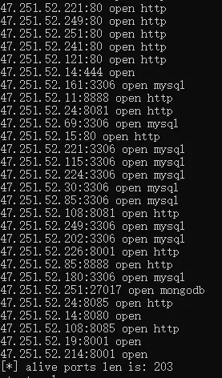
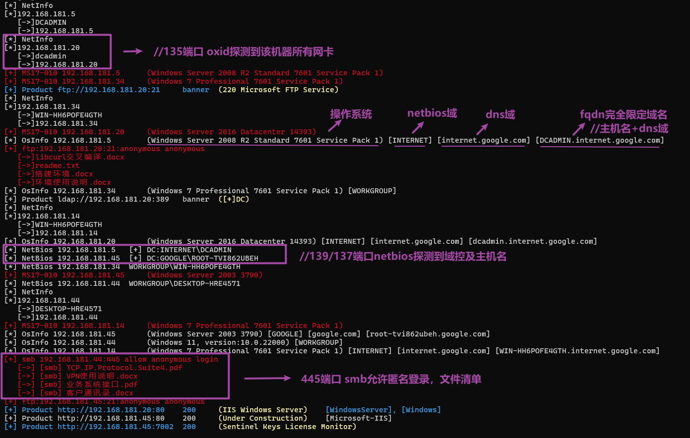
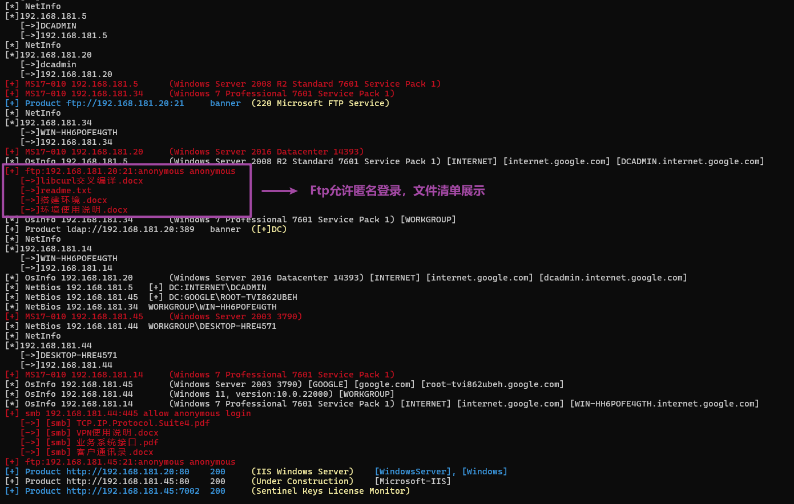
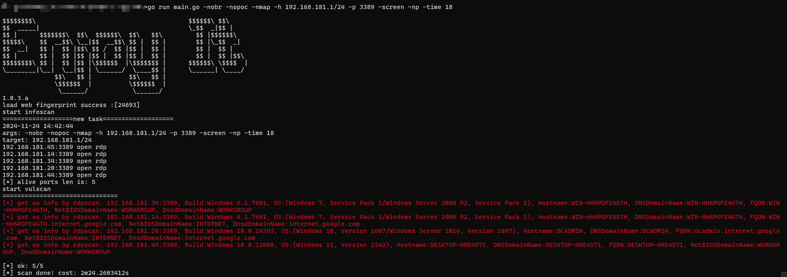
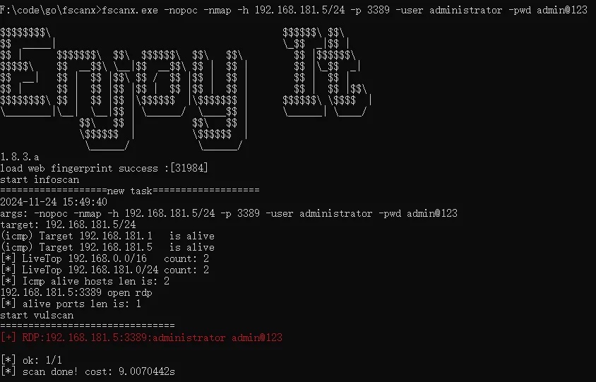
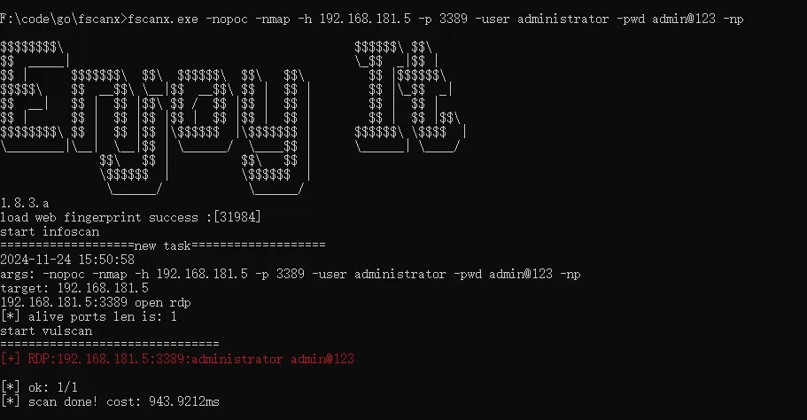
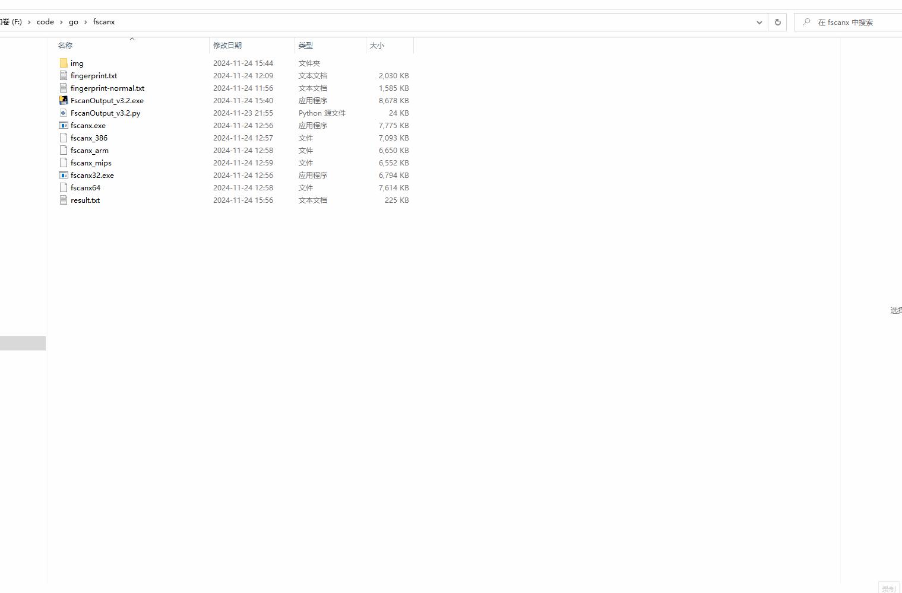
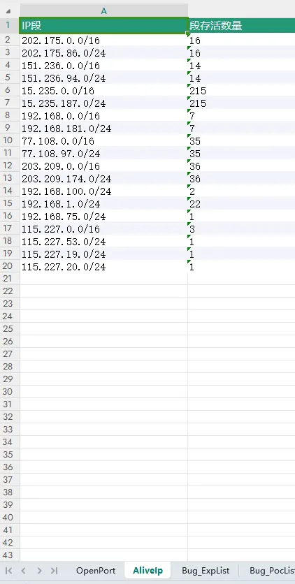
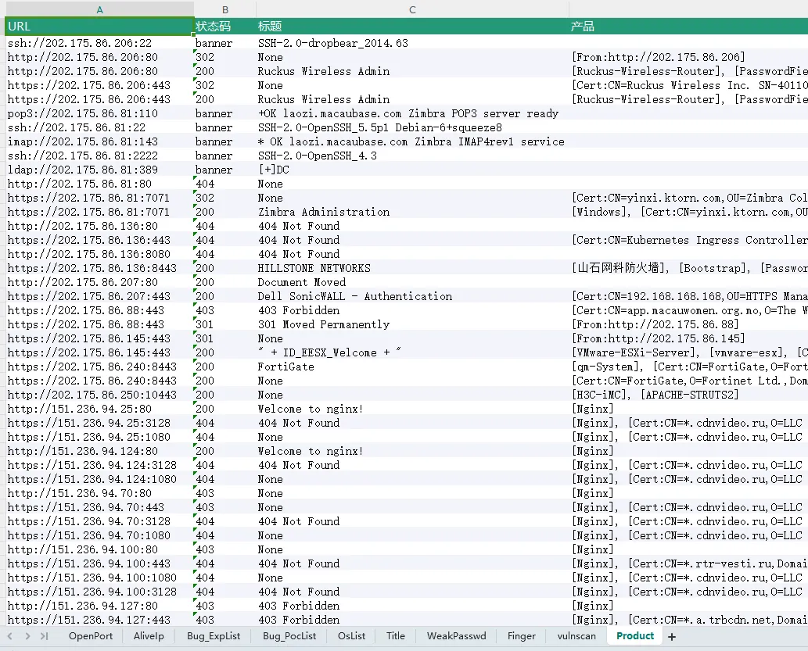

我有一个梦想🤡，  让fscan再次伟大。

众所周知，fscan是一款开源的企业内网资产梳理软件，在无数个寂寞的夜晚，它陪伴安服仔们度过漫漫长夜——当靶标和我之间，只剩倾盆的思念，空无一人的设备房间，态势感知的告警却响彻天边，我独自一人和眼泪周旋，生如浮萍般卑微，爱却苍穹般壮烈。回头再看一眼这璀璨星空，灿烂火光就像盛夏烟火，历经摧残，就要璀璨。

# 为什么
即便在cmd里敲击了那么多遍，fscan依然有一些另我头疼的问题，大部分并非工具本身有质量问题，而是设计理念、应用场景和我的需求有所不同。比如：

1. 工具直接落地到目标内网机器上运行，效果很好。但如果通过代理的方式扫描，就会出现大量误报，每个扫描的端口都会显示开放（不论使用sockscap还是proxychains），并且在代理模式下特定端口上的功能插件无法使用，因为在代码层面上，这些ssh、smb、ftp等等协议使用的库本身就没有写socks5代理的功能，而proxychains、sockcap之类的工具不知道为什么没有hook成功。像我这样的猥琐狗，是不可能落地运行的。维护一个代理工具的免杀就够呛了，其他用到网络的工具都可以通过代理程序对内网操作，做一个工具的免杀就能避免做其他无数个工具的免杀（本地提权类程序除外）。
2. ping扫描无法设定速率，在带宽允许下甚至飙升到10MB/s的icmp包，直接把菜一点的路由器打崩了，互联网直接断开，并发量太大了路由器cpu躺平。不论是本地网络菜、还是对方网络菜，不加限制的ping扫描都可能带来网络故障。而ping扫描又能够极大提高内网测绘的效率，所以不能不要。在我们能够使用vpn接入对方内网的情况下，ping扫描依然是永远的王，快速找到存活段。
3. 这端口开放，扫都扫了，不如把协议识别、web产品识别（web产品、容器、框架技术、标题、https证书、版本）也做了吧，一步到位。
4. 在使用vpn连接目标内网下扫描，会产生把本地网络也扫描到的问题，比如扫描172.16.0.1/24，对方这个网段没有机器，但我们本地网络的上层有（比如可能是电信/联通的），就会直接扫到本地的172.16.0.1/24里的资产，造成误判和干扰，有时甚至打错目标。
5. 略...

# 做了什么
基于以上在企业安全演练中遇到的各种问题，我们对fscan做了研读学习以及一些添砖加瓦。我并不是想取代fscan，而是为自己而打磨一把崭新的fscan，更适合自己的需求和场景。事实上，我们从fscan、kscan等等这些开源工具中学到了很多，我对作者们怀揣志高敬意，感谢他们的优秀作品为我们解决了很多问题，感谢他们为后人奠定了很多扎实的地基。那么我们做了什么？

新增参数汇总：

- -nmap 开启指纹识别
- -prate 设置ping扫描速率（MB/s）
- -pt 设置ping扫描超时（s）
- -screen 开启rdp探测（支持通过rdp探测windows系统版本和主机名)以及rdp截屏
- -iface <网卡ip> 设置出网网卡

## （1）指纹识别
指纹识别包括：

+ 服务协议识别（如ssh、ftp、smb、dns、openvpn这类应用层协议，指纹来自nmap）
+ web产品指纹识别（指纹来自goby、kscan等产品）
+ 可自定义添加web产品指纹（加入到fingerprint.txt）
+ 自定义添加nmap指纹（需要在源码中添加，mylib\gonmap\nmap-service-probes.go）


协议的识别功能，是我整合并修改优化了gonmap的代码，其中：

+ 端口探测部分，增加了socks5代理功能
+ 端口协议的识别，**解决了在代理模式下误报的问题**，这是因为它原先把和代理服务器的端口建立连接认为是端口开放，而如果进行协议识别，会发送各种探针和接收响应，就会知道是不是真的开放。
+ 对探针探测的部分逻辑修改（为了提高速度，牺牲了部分稀有协议的准确率，这在我们的场景给中是合适的）
+ 着重提高了http探测的速度（之前会接收完整的http响应报文，当同时探测多个web端口时会占用很大的带宽、流量、时间，而识别http协议只需要http头部的一些特征即可，这里可忽略一些其他基于http的应用层协议）。
+ 去掉小部分遇到过的误报高的垃圾指纹


那么你问，为什么不直接改用kscan，首先kscan也存在代理扫描方式下的各种问题，其次kscan的输出，个人觉得太乱了很难评🦁，然后它的发包速率调整，实测好像没起作用，至少ping包依然占满带宽，而且！！！kscan的ping扫描极占用cpu！，轻轻松松50~70%，怕管理员机器cpu性能过剩吗，哈哈哈（狗头）。再加上，有些时候，kscan扫描一些段会莫名死掉，啥也扫不到，但用其他扫描器是能扫出来的，感觉是有些隐藏bug的，我也改不动啊。


那么goby之类的攻击面管理工具呢，首先是不开源的，其次是图形化框架_<font style="color:rgb(217, 48, 37);">electron</font>_出现了多次rce漏洞，未来也会存在安全问题，哪天扫到了内网蜜罐被人识别反制就不好了。另外不开源的话，很多灵活的个人需求没法控制、实现、添加，不能自己掌控，感觉很不爽。

### 资产识别效果
协议识别效果，运行时添加-nmap参数即可，识别不出的会显示open空：



资产指纹识别效果（运行时添加-nmap参数即可）：


### Web指纹自定义
在Plugins\scanner.go中，我使用<font style="color:#bcbec4;background-color:#1e1f22;">//go:embed fingerprint.txt </font>将Plugins\fingerprint.txt直接嵌入到编译出的可执行文件中了，并且程序运行时，会自动检测同目录下是否有fingerprint.txt文件，如果有则加载外挂的这个文件，如果没有，则会加载嵌入到可执行文件中的fingerprint.txt作为指纹库。

所以，web指纹的自定义方法有两种，一种是直接修改fingerprint.txt文件添加新指纹然后重新build可执行文件， 另一种是把fingerprint.txt复制一份，修改后放到exe程序同目录，就可以自动使用新定义的指纹文件。

注意，fingerprint.txt的末尾留空一行，不要少也不要多，否则解析可能有问题。

### 远程扫描模式·解锁

远程扫描命令参考：

```
fscanx -nobr -nopoc -nmap -np -socks5 socks5://8.8.8.8:1080 -proxy socks5://8.8.8.8:1080 -t 50 -p 21,22,25,135,389,445,80,443,3389,1433,1521,3306 -h 192.168.100.1/24
```

其中-socks5指定的是端口扫描和各种插件使用的代理，-proxy指定的是http扫描时使用的代理，两个都要设置。并发数-t可以设置小一些，在远程扫的时候。

## （2）Web关键信息提取
+ 多种跳转情况下的跳转URL提取。除了302跳转外，针对js渲染的跳转做了优化，极大增加了没有浏览器情况下探测到真实页面的成功率，目前可适配：
    - location.href
    - window.navigate
    - window.location.replace
    - self.location
    - top.location
+ 页面标题
+ 页面包含的邮箱
+ 页面copyright版权信息
+ https证书信息，公用名 (CN)、组织 (O)、组织单位 (OU)、绑定的域名（Domain）


以上这些信息，都对识别资产身份、组织机构起到重要作用。

## （3）控制ping扫描速率
使用令牌桶控制ping扫描的速率，避免并发太大干死路由器和断网。

另外，修复了原版icmp扫描后统计存活ip数量错误和忽略的bug。


新增参数：

+ -prate <速率>  （单位是M/s。默认为0.1M/s。经实测为最佳实践，调高了可能漏资产，调低了太慢，非必要无需修改）
    - 例如 -prate 0.5
+ -pt <ping扫描的超时时间> （单位是s，默认为6s）
    - 例如 -pt 8

注意，在程序放置到目标机器上运行时，icmp才能生效，通过socks代理是无法代理icmp协议的。

## （4）vpn场景下的错扫修复
新增-iface参数，用来指定出网网卡ip，该选项可以设置探测流量从指定ip的这块网卡走。

适应于在攻击机连接了vpn的情况，用于指定探测流量走vpn虚拟网卡，如果不指定，探测流量可能会走本地网卡，导致探测到本地的上层网络（比如本地路由器上层的运营商网络），而不是探测到目标的内网，导致攻击到错误的目标。

例如，如果vpn连接后，本地获取到的vpn虚拟网口的ip为10.202.100.100，则可以在扫描时指定 -iface：

```plain
fscanx -nobr -nopoc -nmap -iface 10.202.100.100 -h 192.168.0.0/16
```

## （5）smb探测/17010优化
+ 支持更多的Windows版本识别，原版不支持老系统的识别如Windows 2003，原版识别新的系统如win10/win11/2019也是失败的，现在优化后已全部支持。
+ 修复了smb探测在针对windows 2003老系统的情况下，由于yaml转换失败导致os版本识别不成功。
+ 添加了通过smb协议来探测、解析出Windows主机名、netbios域、dns域名的功能。本功能在netbios探测不成功时作为发现Windows信息的补充手段。（下文的rdp探测优化，也会解析出这些重要信息。更多的这些手段都是为了在不同内网采集到更多信息，有些内网的机器不开放135、137、139、445、3389，尽可能多的在各种协议上能收集到信息才是王道）。
+ 修改smb插件逻辑，默认尝试匿名登录，如果成功就会遍历打印出共享目录下的文件名单，以方便快速找到可利用的高价值文件。
+ 增加socks5代理支持。



## （6）ftp探测优化
+ 修改github.com/jlaffaye/ftp库，添加对socks5代理的支持。
    - 这里遇到的坑是ftp登录认证后，进行文件List或者下载都是重新协商一个通信端口发起新的连接，此处也要重新封装dialer。
+ 新增默认情况下尝试匿名登录，如果成功则遍历打印出ftp服务器目录下的文件清单，方便查找高价值文件。



到目前为止，内网中最常见的两种文件服务器（ftp、smb）我们都已经做好了优化，不仅能直接检查匿名登录，还可以打印文件清单，并且支持socks5代理，极大方便了我们对内网的文件服务的检索和浏览，助力找到高价值文件。

## （7）重写rdp探测/截图/爆破
+ 重写rdp插件和grdp库，现在支持：
    - 通过NLA对操作系统版本机型探测（支持win7+并开启了NLA网络验证的所有操作系统的版本识别和输出）
    - rdp截屏（支持win2003+的所有允许PROTOCOL_RDP协议和PROTOCOL_SSL协议的Windows系统，如果只支持PROTOCOL_HYBRID以上协议的则无法截屏，一般默认情况下我记得是win2003、win2008、win7、win2012好像都可以不登录的前提下截屏，再往上由于NLA认证就只能先登录，以前那个灿烂的黄金时代经常有人留shift键、放大镜后门，然后直接在rdp远程界面上利用的，所以才有了NLA，有NLA的时候截屏也是黑色的）
    - 添加-screen选项，使用后能够对rdp探测进行截屏保存，保存在当前目录下的img文件夹
    - 修改grdp库的登录和判断逻辑，适配了win2003-win11全版本的rdp爆破，现在不会产生误报，并且速度极快（当然，rdp爆破要考虑Windows可能锁账号的问题）。
    - 支持socks5代理探测的grdp
+ 参考文献 
    - [死磕RDP协议，从截图和爆破说起](https://zhuanlan.zhihu.com/p/625706098)
    - [像fofa一样解析RDP信息，RDP提取操作系统，RDP登录截屏 （Golang实现） - 先知社区](https://xz.aliyun.com/t/11978?time__1311=mqmx0DBG0Q0%3DiQD8DlOIN7uDjhy9NYK4D&u_atoken=e1156fb72f54d9ac177e7cd589d19a5e&u_asig=1a0c399f17324269820454013e00fa#toc-0)

演示（加上-nmap 和 -screen选项即可）：

```plain
fscanx -nobr -nopoc -nmap -h 192.168.181.1/24 -p 3389 -screen -time 18
```



（由于rdp会传输图像，延迟可以设置长一点，否则有时候会截屏失败）

运行结束后，会在当前目录创建img文件夹，img文件夹里有时间戳命名的子文件夹保存截图文件：


（目前对win2003的截图上，有一些问题，部分2003系统的截图是完整的，有一些则好像颜色不正常，还有就是2003的截图非常慢，有知道的朋友请赐教一下）


口令爆破（加上全段icmp扫描也仅需9s），这一台是个win10：



单端口直接验证仅需1s:



假阳性测试（使用错误的密码），没有误报。（原版对于win7及以上开启了NLA的都会误报为成功）：


## （8）ssh探测优化
    - 修改golang标准库的ssh，增加超时设置。（原因是在实战过程中，发现扫描一些ssh端口后程序一直卡死，在ssl握手的阶段发生了一些问题，但是没有超时就一直卡住）
    - 修改ssh库，增加socks5代理支持

## （9）标准库net/proxy增加udp支持
说实话，在2024年，golang用于socks5客户端的标准库net/proxy依然不支持对udp协议进行代理，对此我是非常震惊的。这也是为什么在socks5代理模式下，netbios探测失败的原因，有兴趣的小伙伴可以查看netbios插件Plugins\NetBIOS.go，这里不仅对tcp139，也会对udp 137端口发送udp探测包来获取机器名、DNS名等，但是golang标准库不支持代理udp，所以发送是失败的🙃（难道这么多年就没人用到udp吗）


在谷歌找了一圈后，只能被迫自己实现一下。具体在mylib\proxy和mylib\socks下。socks5代理udp这块的适配，也遇到一些有意思的，比如现在市面上大家常用的iox、gost、frp等代理工具（的服务端），猜猜有多少个支持udp？

+ iox 不支持代理udp
+ gost 号称支持，但协议应该有所变化， 常规的socks5客户端通信被它的服务端拒绝了，本来请求的是ipv4，应答包却用ipv6的格式返回，搞不懂它了，没有走rfc标准，我记得它为了加密socks通信所以有一些改动。
+ frp 不支持代理udp。作者在issus中提到frp只做一个大框架满足主流需求，如果想要这么细致的功能请自己实现。


哈哈哈。不过实测v2rayN、clash这类上网工具倒是支持udp代理的。


改过的库的udp使用实例在Plugins\NetBIOS.go里，GetNbnsname()函数，依然是使用<font style="color:#bcbec4;background-color:#1e1f22;">common.WrapperTcpWithTimeout</font>获取conn实例，不过network参数设置为”udp“，此时获取到的是*socks.UDPConnSocks5这个我封装好的对象，后边还会看到下面这类的代码，反正是udp的conn的时候就用udp的读写方式就行了：

```plain
	if tConn, ok := conn.(*net.TCPConn); ok {
		for {
			count, err := tConn.Read(buf)
			if err != nil {
				break
			}
			result = append(result, buf[0:count]...)
			if count < size {
				break
			}
		}
	} else if uConn, ok := conn.(*socks.UDPConnSocks5); ok {
		for {
			count, _, err := uConn.ReadFrom(buf)
			if err != nil {
				break
			}
			result = append(result, buf[0:count]...)
			if count < size {
				break
			}
		}
	} 
```

## （10）输出美丽表格
fscan的输出比较乱，一般我直接用FscanOutput这个项目转换为更直观的表格。

当然，为了美观和适配我修改后的输出，我们还是对FscanOutput做了一些修改。

直接把py脚本打包成exe，然后把result.txt拖拽到exe上就可以了。



端口开放情况：


存活ip段：



操作系统：


弱口令：


web产品识别：




# 编译

为了避免不必要的麻烦，本项目不提供可执行文件，请自行编译。

goreleaser方式：

```
go install github.com/goreleaser/goreleaser@latest
goreleaser build  --snapshot  --clean
```

go build方式，直接运行build.bat。
